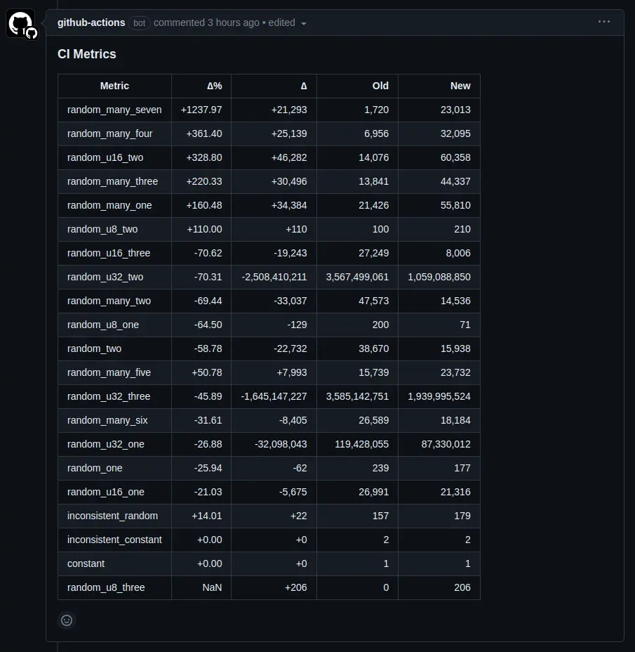

# cimetrics-hello-world

This is a volatile experiment, you shouldn't use this, instead use https://github.com/bencherdev/bencher.

A repo presenting an example system for tracking generic metrics in CI like [codecov](https://about.codecov.io).

On PR's a diff of metrics can be commented, see https://github.com/JonathanWoollett-Light/cimetrics-hello-world/pull/6#issuecomment-1806123695.

You can see the commit history of metrics by visiting http://3.10.39.149:3000/display/6546b543a35b7d5af8c93a7b/206925525691777734527727329171694843736.

## Setup

You can create an account with `curl -X POST http://3.10.39.149:3000/users`, this will return your `public_key` and `private_key`. There is no recovery mechanism, don't loose these.

Metrics can be plotted on the same graph by setting metric sets.

You can use `curl -X GET http://3.10.39.149:3000/metrics/sets -d { "public_key": "<your public key>", "private_key": <your private key> }` to get the current sets on your account.

You can use `curl -X POST http://3.10.39.149:3000/metrics/sets -d { "user": { "public_key": "<your public key>", "private_key": <your private key> }, "metric_sets": [["metric_one","metric_two"]]}` to set the current sets on your account. In this case it sets 1 set which will plot `metric_one` and `metric_two` on the same graph

To display metrics visit `http://3.10.39.149:3000/display/<your public key>/<your private key>` and enter the repository into the input box.

For the rest look at this repo as an example.