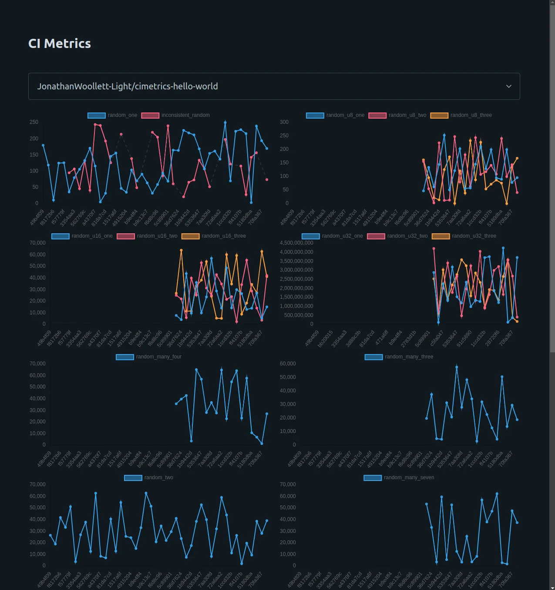

# cimetrics-hello-world

A repo presenting an example system for tracking generic metrics in CI like [codecov](https://about.codecov.io).

On PR's a diff of metrics can be returned, see https://github.com/JonathanWoollett-Light/cimetrics-hello-world/actions/runs/6757698561/job/18368508842/.

You can see the commit history of metrics by visiting http://3.10.39.149:3000/display/6546b543a35b7d5af8c93a7b/206925525691777734527727329171694843736 and entering `JonathanWoollett-Light/cimetrics-hello-world` in the input box.

### Setup

You can create an account with `curl -X POST http://3.10.39.149:3000/users`, this will return your `public_key` and `private_key`. There is no recovery mechanism, don't loose these.

To upload metrics see [upload.sh](./upload.sh).

To diff metrics see [diff.sh](./diff.sh).

To display metrics see above.